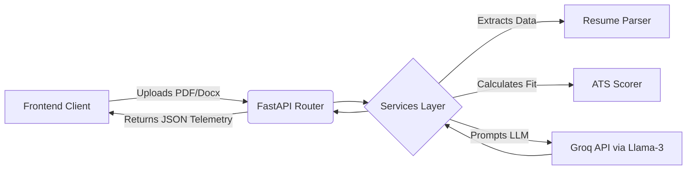

<div align="center">
  
  
  
</div>

<h1 align="center"> CampusHire.AI</h1>

<p align="center">
  <b>The Enterprise-Grade Autonomous Recruitment & Screening Engine.</b><br/>
  Transforming how modern startups and talent teams evaluate, screen, and interview candidates at scale.
</p>

---

## 🎯 Why CampusHire.AI? (For Founders & Talent Leaders)

In the modern hiring landscape, traditional ATS (Applicant Tracking Systems) are brittle, and human screening is impossibly slow. **CampusHire.AI** is built to solve the talent bottleneck. 

It provides an autonomous, deeply analytical pipeline that bridges the gap between raw candidate applications and final hiring decisions:
- **For Candidates:** A highly cinematic, real-time environment to parse their resumes, identify competency gaps against actual Job Descriptions, and practice via high-pressure, multi-agent mock interviews.
- **For Talent Teams:** Eliminates false positives by standardizing behavioral and technical screening. The system's acoustic intelligence and structural parsing surface the strongest candidates dynamically.

---

## ✨ Core Business Solutions

### 1. 📄 Deep-Parsing ATS Scorer
*Eliminate keyword guessing and brittle regex-only filters — with scores you can replay.*
- **Deterministic parsing:** PDF/DOCX/TXT text extraction plus heuristic section, contact, skill-lexicon, experience, and education parsers. Same file → same structure (no LLM in the parse path).
- **Deterministic scoring:** Fixed weighted rubric (skills, experience, education, TF-IDF keyword density, formatting, achievements). Same resume + JD → identical scores without calling Groq.
- **Hybrid feedback:** Actionable tips are derived from score evidence; an optional LLM rewrite may polish wording when configured, but cannot invent numbers.

### 2. 🛡️ Autonomous Interview Committee
*Scale your technical and behavioral screening infinitely.*
- **Multi-Persona Evaluation:** Candidates defend their qualifications against an autonomous panel consisting of a **Technical Lead**, **HR Manager**, and **Domain Expert**.
- **Targeted Inquiry:** Generates custom, dynamic interview questions mapped to the exact intersection of the candidate's resume and your company's target role.
- **Real-time Consensus:** Answers are evaluated instantly across multiple dimensions, providing a unified panel verdict, effectively automating the preliminary screening round.

### 3. 🎙️ Acoustic Voice Studio
*Behavioral analytics powered by voice telemetry.*
- **Vocal Telemetry:** Measures pacing (WPM), filler word density, and pause ratios to gauge candidate confidence and communication clarity.
- **Speech-to-Text Analytics:** Live transcription feeds mapped directly to evaluation endpoints for verifiable behavioral analysis.

---

## 🛠️ Technology Stack & Architecture

Built for scale, speed, and absolute resilience. 

### Frontend: Cinematic React Interface
- **Core:** React 18 powered by Vite for instant HMR and optimized build compilation.
- **Styling:** CSS Modules paired with a bespoke foundational token system (`_tokens.css`), enabling dynamic theme switching (Dark/Light mode) without the overhead of bloated component libraries.
- **Animations:** Framer Motion drives fluid, cinematic transitions and micro-animations, while custom decoupling hooks manage terminal-style typing feeds securely.
- **Layout Architecture:** A custom **Dual-Zone System** splits the screen into a 60% Primary Workspace and a 40% Persistent Intelligence Panel, ensuring contextual telemetry is always visible to the user.

### Backend: High-Performance Python API
- **Core Engine:** FastAPI provides asynchronous request handling, achieving massive concurrency for I/O bound LLM network calls.
- **Data Validation:** Pydantic strictly enforces JSON schemas for both incoming client requests and parsed LLM responses, preventing hallucinated data structures from crashing the pipeline.
- **Document Processing:** `PyPDF2` and `python-docx` extract raw text in-memory from user uploads before injecting them into the AI context window.
- **Telemetry Middleware:** Custom API interceptors track system latency and LLM payload sizes across all routes.

### Artificial Intelligence & Voice
- **Hybrid design:** Resume parse + ATS score are **deterministic** (rules, skill lexicon, TF-IDF). Groq powers interview question generation, optional feedback prose polish, and multi-agent panel evaluation — not the ATS number itself.
- **Inference Engine:** [Groq](https://groq.com) for LLM-assisted flows via `openai/gpt-oss-120b` (configurable via `GROQ_MODEL`).
- **Acoustic Intelligence:** Browser-native `MediaRecorder` captures WebM audio; tone metrics (WPM, fillers, pauses) are computed deterministically in code.

---

## 🚀 Deployment & Quick Start

Get the intelligence engine running locally or deploy it to production in minutes.

### Prerequisites
* Python 3.8+
* Node.js 16+
* [Groq API Key](https://console.groq.com)

### 1. Initialize the Backend (FastAPI)

```bash
# 1. Navigate to the backend
cd backend

# 2. Create and activate a virtual environment
python -m venv venv
source venv/bin/activate  # On Windows: venv\Scripts\activate

# 3. Install core dependencies
pip install -r requirements.txt

# 4. Configure Environment
# Create a .env file in the root of the project with:
# GROQ_API_KEY=your_groq_api_key_here

# 5. Boot the server
uvicorn main:app --reload
```
*The API matrix is now live at `http://127.0.0.1:8000`*

### 2. Initialize the Frontend (React + Vite)

```bash
# 1. Navigate to the frontend
cd frontend

# 2. Install dependencies
npm install

# 3. Boot the UI
npm run dev
```
*The Workspace is now live at `http://localhost:5173`*

---

## 📡 API Architecture

The backend exposes a clean RESTful interface for seamless integration into existing HR tools.



| Endpoint | Method | Purpose |
| :--- | :--- | :--- |
| `/api/resume/score` | `POST` | Deterministic ATS validation & missing keyword analysis |
| `/api/interview/questions` | `POST` | Generates targeted behavioral/technical questions |
| `/api/interview/panel-evaluate` | `POST` | Submits answers to the Multi-Agent panel for scoring |
| `/api/telemetry` | `GET` | System health, API latency, and uptime metrics |

### Backend tests (deterministic ATS)

```bash
# from repo root
python -m pytest backend/tests -v
```

Parser and ATS scorer tests require no API keys.

---

<p align="center">
  <i>Redefining Talent Acquisition for the AI Era.</i>
</p>
